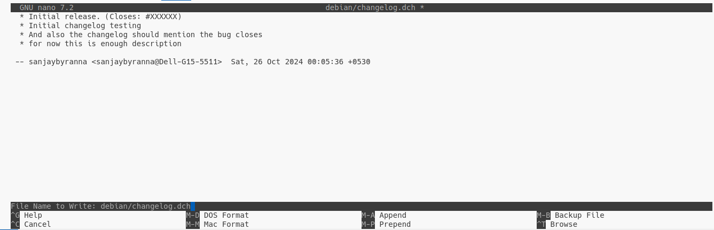

### ==W: coffee-shop: file-in-unusual-dir [usr/local/bin/coffee_shop]==

The warning `W: coffee-shop: file-in-unusual-dir [usr/local/bin/coffee_shop]` indicates that your Debian package contains a file located in an unusual directory, specifically `/usr/local/bin/`. In Debian packaging, certain directories are expected for specific types of files, and `/usr/local/bin/` is typically reserved for locally installed software that is not managed by the package manager.

To resolve this warning, you have a couple of options:

1. **Move the File**: If the file is part of your package and should be managed by the package manager, consider moving it to a more appropriate directory, such as `/usr/bin/`. This is the standard directory for executable binaries that are part of packages managed by the system's package manager.

   - Update your `debian/install` file (if you have one) or the relevant section in your `debian/rules` file to reflect the new location.

2. **Leave It as Is**: If you intentionally want to install the file in `/usr/local/bin/` (for example, if it's meant to be a local installation), you can choose to ignore this warning. However, be aware that this may lead to confusion for users who expect package-managed files to be in standard locations.

3. **Document the Decision**: If you decide to keep the file in `/usr/local/bin/`, consider documenting this choice in your package's README or other documentation to inform users about the installation location.

---

==W: coffee-shop: non-standard-dir-perm 0775 != 0755 [usr/]==

==W: coffee-shop: non-standard-dir-perm 0775 != 0755 [usr/local/]==

==W: coffee-shop: non-standard-dir-perm 0775 != 0755 [usr/local/bin/]==

indicate that the permissions for the directories `/usr/`, `/usr/local/`, and `/usr/local/bin/` in your Debian package are set to `0775`, which is not the standard permission setting. The standard permission for these directories is `0755`.

### Understanding Permissions:

- `0755` means that the owner has read, write, and execute permissions, while the group and others have read and execute permissions.
- `0775` means that the owner and group have read, write, and execute permissions, while others have read and execute permissions.

**Fix**

- **Change Directory Permissions**: You need to ensure that the permissions for these directories are set to `0755`. You can do this in your `debian/rules` file or by using the `chmod` command in the appropriate section of your packaging scripts.

  > #### 1. You can add the following lines to your `debian/rules` file:
  >
  > ```makefile
  > override_dh_auto_install:
  >    dh_auto_install
  >    chmod 0755 debian/tmp/usr
  >    chmod 0755 debian/tmp/usr/local
  >    chmod 0755 debian/tmp/usr/local/bin
  > ```
  >
  > Rebuild the Package: After making these changes, rebuild your Debian package using the following command:
  >
  > ```bash
  > dpkg-buildpackage -us -uc
  > ```
  >
  > After rebuilding, check if the warnings about non-standard directory permissions have been resolved.
  >
  > #### 2. Else we can just change file permission before `deb build`
  >
  > Open terminal in root of the workspace and then change the file permission manually and then `build` the package.
  >
  > To do that we need to have sudo permission
  >
  > ```bash
  > chmod 755 DEBIAN
  > chmod 644 DEBIAN/control
  > chmod 755 usr/bin/executable
  > chmod 755 usr/share/doc/coffee-shop
  > chmod 644 usr/share/doc/coffee-shop/changelog
  > chmod 644 usr/share/doc/coffee-shop/copyright
  > ```
  >
  > If this doesn't change the lintian error trying using tis commands with sudo permission

- **Verify Permissions**: You can verify the permissions of the directories in your package by using the `ls -ld` command on the directories in your build environment.

---

==W: coffee-shop: description-starts-with-leading-spaces line 1==

- This is the error related to `control` file.
- After the first line of `decription` in `debian/control` file we might have few extra spaces.
- If not the extra spaces will be near the second line or in the detailed description we write.
- Each detailed description lines should only have one space indentation not more than that

Corrected `Control` file

```control
Package: coffee-shop
Version: 1.0
Section: utils
Priority: optional
Architecture: amd64
Depends: libgtk-3-0, libsqlite3-0, libc6
Maintainer: Sanjay S B <sbsa597@gmail.com>
Description: Simple coffee shop application.
 This application allows users to manage orders in a coffee shop.
 It provides a graphical interface for selecting beverages and tracking orders.
```

---

==E: coffee-shop: unstripped-binary-or-object [usr/bin/executable]==

The warning indicates that the binary file located at `/usr/bin/executable` in your Debian package is not stripped. Stripping a binary means removing the symbol table and debugging information, which reduces the size of the binary and makes it less readable for debugging purposes.

> #### Why Strip Binaries?
>
> Stripping binaries is a common practice in packaging to:
>
> - Reduce the size of the package.
> - Prevent users from easily reverse-engineering the code.
> - Improve load times for the executable.
>
> #### How to Strip the Binary
>
> To resolve this warning, you can modify your `debian/rules` file to include a step that strips the binary after it has been built. Here’s how you can do it:
>
> #### Before moving the binary to the correct location, strip it:
>
> ```bash
> strip executable
> ```
>
> #### or use the `debian/rules`
>
> - **Open the `debian/rules` File**: Locate and open your `debian/rules` file.
>
> - **Add the Stripping Command**: You can add a command to strip the binary in the appropriate target. For example, you can add it after the `dh_auto_install` step:
>
>   ```makefile
>   override_dh_auto_install:
>         dh_auto_install
>         # Strip the binary
>         strip --strip-unneeded debian/tmp/usr/bin/executable
>   ```
>
>   - Replace `executable` with the actual name of your binary.
>
> - **Rebuild the Package**: After making these changes, rebuild > > your Debian package:
>
> ```bash
> dpkg-buildpackage -us -uc
> ```
>
> - **Check for Warnings**: After rebuilding, check if the warning about the unstripped binary has been resolved.
>
> #### Alternative: Using `dh_strip`
>
> If you are using `debhelper`, you can also use the built-in `dh_strip` command, which automatically strips binaries for you. You can add it to your `debian/rules` file like this:
>
> ```makefile
> override_dh_strip:
>     dh_strip --dbg-package=coffee-shop-dbg
> ```
>
> This will strip the binaries and create a separate debug package if you want to keep the debugging symbols.

---

==E: coffee-shop: wrong-file-owner-uid-or-gid 1000/1000 [usr/]==

==E: coffee-shop: wrong-file-owner-uid-or-gid 1000/1000 [usr/bin/]==

==E: coffee-shop: wrong-file-owner-uid-or-gid 1000/1000 [usr/bin/executable]==

The errors indicate that the files in your Debian package are owned by a user ID (UID) and group ID (GID) of `1000`, which is typically the UID and GID of the first non-root user created on a Debian-based system.

In Debian packaging, files in the package should not have specific user or group ownerships that are tied to a particular user on the system. Instead, they should be owned by the root user (UID 0) and the root group (GID 0).

#### How to Fix the Ownership Issue

Before building the debian package use `chown` to change the ownership

```bash
chown -R root:root debian/tmp/usr
```

> **If these below errors occur then use the `sudo` to execute the above commands again**
>
> chown: changing ownership of 'usr/bin/executable': Operation not permitted
>
> chown: changing ownership of 'usr/bin': Operation not permitted
>
> chown: changing ownership of 'usr': Operation not permitted

#### [or] Use the `debian/rules`

1. **Change Ownership in the `debian/rules` File**: You can modify your `debian/rules` file to ensure that the files are owned by root when the package is built. You can use the `chown` command to change the ownership of the files after they are installed in the temporary directory.

   Here’s how you can do it:

   ```makefile
   override_dh_auto_install:
       dh_auto_install
       # Change ownership to root
       chown -R root:root debian/tmp/usr
   ```

2. **Rebuild the Package**: After making these changes, rebuild your Debian package:

   ```bash
   dpkg-buildpackage -us -uc
   ```

3. **Check for Errors**: After rebuilding, check if the errors about wrong file ownership have been resolved.

---

==E: coffee-shop: no-changelog usr/share/doc/coffee-shop/changelog.gz (native package)==

The error indicates that your Debian package is missing a changelog file, which is required for native packages. A native package is one that is not intended to be distributed as a source package; it is typically created from a source that is already in the form of a Debian package.

**Fix**

**Use `dch` to Create the Changelog**: The easiest way to create and manage the changelog is to use the `dch` (Debian ChangeLog) command. You can run the following command in your package directory:

> But to use `dch` command you need to have a `debian/` folder
> so create a `debian/` folder where ever you want

let us have the `debian/` folder outside the `build/` folder

```tree
.
├── build
│   ├── DEBIAN
│   │   └── control
│   └── usr
│       └── bin
│           └── executable
├── build.deb
└── debian

6 directories, 3 files
```

> To use `dch --create` we need to install `devscripts`
>
> ```bash
> sudp apt-get install devscripts
> ```
>
> run the below command in the folder that contains `debian/` folder
>
> ```bash
> dch --create
> ```
>
> **Output of this command**
>
> ```bash
> dch warning: neither DEBEMAIL nor EMAIL environment variable is set
> dch warning: building email address from username and FQDN
> dch: Did you see those 2 warnings?  Press RETURN to continue...
> ```
>
> this opens a editor window to edit the changelog file that will contain predefined sections that has to changed like version, bug fix, contact information, date and time. and also maintain the indentations correctly.
>
> 

**Format of the Changelog**: The `changelog` file should follow a specific format. Here’s an example of what it might look like:

```plaintext
coffee-shop (1.0-1) UNRELEASED; urgency=medium

  * Initial release. (Closes: #XXXXXX)
  * Initial changelog testing
  * And also the changelog should mention the bug closes
  * for now this is enough description

 -- sanjaybyranna <xyz@gmail.com>  Sat, 26 Oct 2024 00:05:36 +0530

```

> After this file is created in debian folder we have covert it to a zip file of format .gz with higest level of compression
>
> go to `debian/` folder, then compress the changelog.dch file to .gz file with highest level of compression
>
> ```bash
> gzip -9 changelog
> ```

```tree
.
├── build
│   ├── DEBIAN
│   │   └── control
│   └── usr
│       └── bin
│           └── executable
├── build.deb
└── debian
    └── changelog.gz

6 directories, 4 files
```

> then we have to create a document folder inside `usr/share/doc/<our-package-name>` that will contain the copyright file.
>
> go to root folder and create this path
>
> ```bash
> sudo mkdir -p build/usr/share/doc/coffee-shop
> ```

```tree
.
├── build/
│   ├── DEBIAN/
│   │   └── control
│   └── usr/
│       ├── bin/
│       │   └── executable
│       └── share/
│           └── doc/
│               └── coffee-shop/
├── build.deb
└── debian/
    └── changelog.gz

9 directories, 4 files
```

> Then move the `changelog.gz` file from `debian/changelog` to `/usr/share/doc/coffee-shop/changelog`
>
> ```bash
> sudo mv debian/changelog.gz build/usr/share/doc/coffee-shop/
> ```

```tree
.
├── build/
│   ├── DEBIAN/
│   │   └── control
│   └── usr/
│       ├── bin/
│       │   └── executable
│       └── share/
│           └── doc/
│               └── coffee-shop/
│                   └── changelog.gz
├── build.deb
└── debian/
    └── (no changelog file here anymore)

9 directories, 4 files
```

> Once changelog moved we will build the deb package and check for lintian errors

> After all these steps we end up getting these errors
>
> ```errors
> E: coffee-shop: bad-owner-for-doc-file sanjaybyranna/sanjaybyranna != root/root (or 0/0) [usr/share/doc/coffee-shop/changelog.gz]
> E: coffee-shop: no-copyright-file
> E: coffee-shop: wrong-file-owner-uid-or-gid 1000/1000 [usr/share/doc/coffee-shop/changelog.gz]
> W: coffee-shop: initial-upload-closes-no-bugs [usr/share/doc/coffee-shop/changelog.gz:1]
> W: coffee-shop: no-manual-page [usr/bin/executable]
> W: coffee-shop: non-standard-file-perm 0664 != 0644 [usr/share/doc/coffee-shop/changelog.gz]
> W: coffee-shop: package-contains-timestamped-gzip 2024-10-25T18:45:23 [usr/share/doc/coffee-shop/changelog.gz]
> W: coffee-shop: wrong-bug-number-in-closes #XXXXXX [usr/share/doc/coffee-shop/changelog.gz:3]
> ```

To solve this use below commands

**Bad Owner for Doc File**

==E: coffee-shop: bad-owner-for-doc-file sanjaybyranna/sanjaybyranna != root/root (or 0/0)==

```bash
sudo chown root:root build/usr/share/doc/coffee-shop/changelog.gz
```

**Non-Standard File Permission:**

==W: coffee-shop: non-standard-file-perm 0664 != 0644 [usr/share/doc/coffee-shop/changelog.gz]==

```bash
sudo chmod 644 build/usr/share/doc/coffee-shop/changelog.gz
```

**In changelog use valid Bug close number:**

==W: coffee-shop: wrong-bug-number-in-closes #XXXXXX [usr/share/doc/coffee-shop/changelog.gz:3]==

```text
* Initial release. (Closes: #123456)
```

> New changelog
>
> ```changelog
> coffee-shop (1.0-1) UNRELEASED; urgency=medium
>
>   * Initial release. (Closes: #123456)
>   * This new changelog includes the valid Bug closes ID instead of a #xxxxxx placeholder
>
>  -- sanjaybyranna <xyz@gmail.com>  Sat, 26 Oct 2024 00:41:20 +0530
>
> ```

**Timestamped Gzip:**

==W: coffee-shop: package-contains-timestamped-gzip 2024-10-25T18:45:23 [usr/share/doc/coffee-shop/changelog.gz]==

This warning indicates that the changelog.gz file contains a timestamp. You can create a gzip file without a timestamp using the --no-name option:

```bash
gzip --no-name -9 debian/changelog
```

To retain the original file changelog.dch and create the seperate changelog.gz file

```bash
gzip --no-name -9 -k debian/changelog
```

> Again move the newly created chagelog to `doc` folder
>
> ```bash
> sudo cp debian/changelog.gz build/usr/share/doc/coffee-shop/
> ```
>
> ==W: coffee-shop: debian-changelog-line-too-long [usr/share/doc/coffee-shop/changelog.gz:4]==
>
> Again we have this changelog too long error, avoid writing lengthy changelog
>
> For everychange copy of new changelog change the owner permission and file access permission using `chown` and `chmod`

```tree
.
├── build
│   ├── DEBIAN
│   │   └── control
│   └── usr
│       ├── bin
│       │   └── executable
│       └── share
│           └── doc
│               └── coffee-shop
│                   └── changelog.gz
├── build.deb
└── debian
    └── changelog.gz
```

---

==E: coffee-shop: no-copyright-file==

This file is essential for providing information about the licensing of the package and its contents.

In `usr/share/doc/<package-name>` create a copyright file

```copyright
Format: http://www.debian.org/doc/packaging-manuals/copyright-format/1.0/
Upstream-Name: your-package-name
Source: http://example.com/your-package-source

Files: *
Copyright: 2023 Your Name <your.email@example.com>
License: GPL-3+
```

---

==W: coffee-shop: no-manual-page [usr/bin/executable]==

The warning `no-manual-page` from `lintian` indicates that your package does not include a manual page for the executable located in `usr/bin/executable`. Manual pages (man pages) are an important part of Unix-like systems, providing users with documentation on how to use commands and programs.

To resolve this warning, you can create a manual page for your executable. Here’s how to do it:

#### Steps to Create a Manual Page

1. **Create a Manual Page**: You can write a manual page in the `groff` format. Create a file named `executable.1` (the `.1` indicates that it's a section 1 man page) in a suitable directory, such as `usr/share/man/man1/`

   Folder structure:

   ```tree
   .
   ├── build
   │   ├── DEBIAN
   │   │   └── control
   │   └── usr
   │       ├── bin
   │       │   └── executable
   │       └── share
   │           ├── doc
   │           │   └── coffee-shop
   │           │       ├── changelog.gz
   │           │       └── copyright
   │           └── man
   │               └── man1
   │                   └── executable.1
   ├── build.deb
   └── debian
       └── changelog.gz

   11 directories, 7 files
   ```

2. **Write the Manual Page**: Open `executable.1` and write the content. Here’s a simple template to get you started:

   ```groff
   .TH EXECUTABLE 1 "September 2023" "1.0" "Your Package Name"
   .SH NAME
   executable \- brief description of the command
   .SH SYNOPSIS
   .B executable
   [options]
   .SH DESCRIPTION
   A more detailed description of what the executable does.
   .SH OPTIONS
   .TP
   .B -h, --help
   Show help message and exit.
   .SH AUTHOR
   Your Name <your.email@example.com>
   ```

   Replace the placeholders with relevant information about your executable.

3. **Rebuild Your Package**: After adding the manual page and updating the necessary files, rebuild your Debian package.

4. **Run `lintian` Again**: After rebuilding, run `lintian` on your package again to check if the warning has been resolved.

So here we have these many errors

```bash
E: coffee-shop: uncompressed-manual-page [usr/share/man/man1/executable.1]
W: coffee-shop: groff-message command exited with status 2: /usr/libexec/man-db/zsoelim | /usr/libexec/man-db/manconv -f UTF-8:ISO-8859-1 -t UTF-8//IGNORE | preconv -e UTF-8 | groff -mandoc -Z -rLL=117n -rLT=117n -wmac -Tutf8 [usr/share/man/man1/executable.1:2]
W: coffee-shop: groff-message error: troff: Segmentation fault (core dumped) [usr/share/man/man1/executable.1:1]
```

The errors and warnings you're encountering from `lintian` indicate issues with the formatting of your man page. Specifically, the error `uncompressed-manual-page` suggests that the man page is not in the expected format, and the `groff-message` warnings indicate that there may be a problem with the content of the man page itself.

### Steps to Resolve the Issues

1. **Check the Man Page Format**: Ensure that your `executable.1` file is correctly formatted. Here’s a simple example of what a man page should look like:

   ```groff
   .TH EXECUTABLE 1 "September 2023" "1.0" "Your Package Name"
   .SH NAME
   executable \- brief description of the command
   .SH SYNOPSIS
   .B executable
   [options]
   .SH DESCRIPTION
   A more detailed description of what the executable does.
   .SH OPTIONS
   .TP
   .B -h, --help
   Show help message and exit.
   .SH AUTHOR
   Your Name <your.email@example.com>
   ```

   Make sure that:

   - The `.TH` line is correctly formatted.
   - Each section starts with `.SH` or `.TP` as appropriate.
   - There are no syntax errors or unsupported characters.

   > Then Compress the executable.1 file in gzip format using below command
   >
   > remove the timestamp from file using `--no-name` and also compress at level 9
   >
   > ```bash
   > sudo gzip --no-name -9 build/usr/share/man/man1/executable.1
   > ```
   >
   > **Compression error solved**
   >
   > ***
   >
   > Folder structure
   >
   > ```tree
   > .
   > ├── build
   > │   ├── DEBIAN
   > │   │   └── control
   > │   └── usr
   > │       ├── bin
   > │       │   └── executable
   > │       └── share
   > │           ├── doc
   > │           │   └── coffee-shop
   > │           │       ├── changelog.gz
   > │           │       └── copyright
   > │           └── man
   > │               └── man1
   > │                   └── executable.1.gz
   > ├── build.deb
   > └── debian
   >     └── changelog.gz
   >
   > 11 directories, 7 files
   > ```

2. **Check for Hidden Characters**: Sometimes, hidden characters or incorrect line endings can cause issues. You can check for hidden characters using `cat -v`:

   ```bash
   cat -v build/usr/share/man/man1/executable.1
   ```

   If you see any unexpected characters, you may need to clean up the file.

3. **Test the Man Page Locally**: Before rebuilding the package, you can test the man page locally to see if it displays correctly. Use the following command:

   ```bash
   man -l build/usr/share/man/man1/executable.1
   ```

   This will show you the man page as it would appear when installed. If there are any errors, they will be displayed here.

4. **Rebuild the Package**: After making any necessary corrections to the man page, rebuild your Debian package:

   ```bash
   dpkg-deb --build build
   ```

5. **Run `lintian` Again**: Check the package with `lintian` again:

   ```bash
   lintian build.deb
   ```

- **Segmentation Fault**: The segmentation fault error from `groff` could indicate a deeper issue with the formatting or content of the man page. If the above steps do not resolve the issue, consider simplifying the man page to the most basic content and gradually adding sections back to identify what might be causing the problem.

---

### Final folder structure

```c
.
├── build
│   ├── DEBIAN
│   │   └── control
│   └── usr
│       ├── bin
│       │   └── executable
│       └── share
│           ├── doc
│           │   └── coffee-shop
│           │       ├── changelog.gz
│           │       └── copyright
│           └── man
│               └── man1
│                   └── executable.1.gz
├── build.deb
└── debian
    └── changelog.gz

11 directories, 7 files
```

---

[Previous <- \_2. Creating a simple DEB package](2.%20Creating%20a%20simple%20DEB%20package.md)
