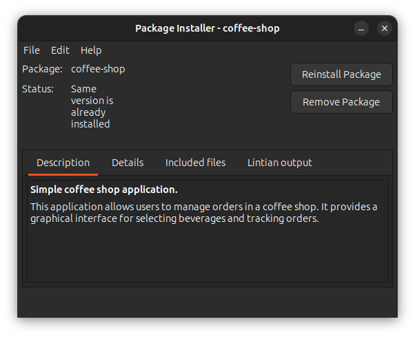
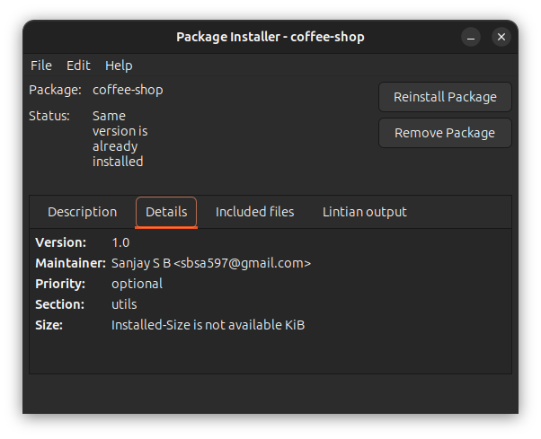
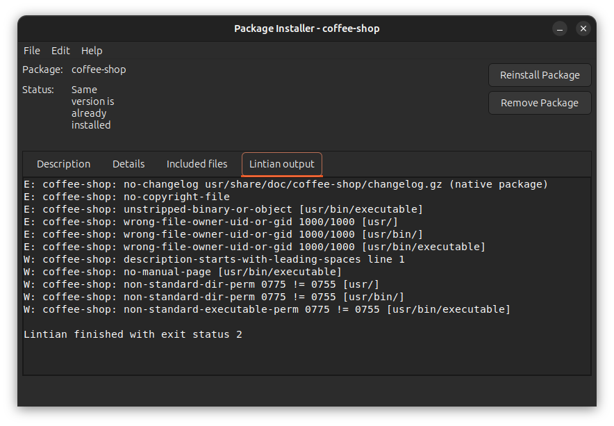
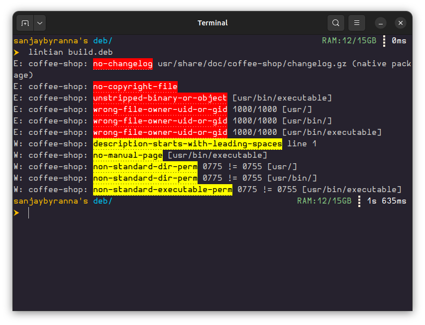

## Recommendations

> - You can follow the Official manual to dig deep into debian community, but i have tried explaining the basic debian packaging with an example
>
> - This [Official debian manual](https://www.debian.org/doc/manuals/maint-guide/index.en.html) is for debian package building guide.

## Structure of .deb package

> - “deb package” is an archive of binaries and configuration files associated with a software application. All the files inside the archive are kept in a specific folder structure.
> - During installation, in the target machine, the binaries and configuration files go into a similar folder structure from the root folder.

## Application files

A simple `deb` package requires `executable file` and a `control file`

**The folder structure**:

```tree
.
└── deb/
    └── build/
4 directories, 1 file
```

> `deb` and `build` folder names can be anything
>
> - Like `build` folder name could also be the project title
> - But this is the standard names used while creating the deb package.

---

## Binaries and scipts

> Usually the Deb package is mostly used for packaging binary executable or a shell scripts.

For our example let me take a C program binary executable file.

so while creating a control file, the required dependancies for those binary executables has to be mentioned in `control` file.

For example consider a `coffee vendor.c` file in the `root workspace folder`

```tree
.
├── coffee-vender.c
└── deb/
    └── build/

3 directories, 1 file
```

> then suppose it is compiled using this gcc command
>
> ```bash
> gcc -o executable coffee-vender.c `pkg-config --cflags --libs gtk+-3.0` -lsqlite3 -lpthread
> ```
>
> - This compile command will create a binary file called `executable`
>
> - That binary file contains the Source file and the library functions complied together
>
> - So if we have a dunamic library linking then we should mention the dependancy for that binary in a `control` file, (which we will be discussing further)

After compiling binary we have the folder structure like this

```tree
.
├── coffee-vender.c
├── deb/
│   └── build/
└── executable

3 directories, 2 files
```

> ==NOTE==
>
> - Most of the debian binaries written by users are saved in `/usr/local/bin`.
> - So move that `executable` to `/usr/local/bin` in the current workspace root directory.
> - For now consider `usr/bin`
> - the folder structure now looks like this

```tree
.
├── coffee-vender.c
└── deb/
    └── build/
        └── usr/
            └── bin/
                └── executable

5 directories, 2 files
```

---

## control file

This file contains various values which dpkg, dselect, apt-get, apt-cache, aptitude, and other package management tools will use to manage the package.

> - for now dont think about dpkg, dselect, apt-get, apt-cache, aptitude,
> - they are just package building tools

- We need a control file that contains the metadata for the package.
- This is a text file with fields and descriptions. The supported fields are:

  - **Package** `(Required)`: Name of package
  - **Version** `(Required)`: Version of the package
  - **Maintainer** `(Required)`: Name and email of maintainer
  - **Architecture** `(Required)`: Supported target machine architecture
  - **Description** `(Required)`: Brief and Detailed description of the package
  - **Section**: Package classification like admin, database, kernel, utils
  - **Priority**: Whether the package is optional or required
  - **Essential**: Whether the package is always required
  - **Depends**: List other dependent packages like libc6 (>= 2.2.4-4)
  - **Homepage**: URL of the website associated with the package
  - **Package-Type**: Indicate the types, like deb or udeb, for example

As mentioned above, some fields are required and others are optional.

Using this information, let’s create a control file with the required fields and some of the recommended fields. This file goes under a folder named DEBIAN:

Now the folder structure looks like:

```tree
.
├── coffee-vender.c
└── deb/
    └── build/
        ├── DEBIAN/
        │   └── control
        └── usr/
            └── bin/
                └── executable

6 directories, 3 files
```

> Control file content:
>
> ==[NOTE]==
>
> There should be a new line at the last line of control file.
>
> And also the indentation while writting the Description should follow certain rules
>
> - `Description`: </followed by brief decription/>
> - </proper one space indentation/> </and follow the detailed Description/>

Control file content

```control
Package: coffee-shop
Version: 1.0
Section: utils
Priority: optional
Architecture: amd64
Depends: libgtk-3-0, libsqlite3-0, libc6
Maintainer: Sanjay S B <sbsa597@gmail.com>
Description: Simple coffee shop application.
 This application allows users to manage orders in a coffee shop.
 It provides a graphical interface for selecting beverages and tracking orders.

```

> Only one space indent for detailed Description
>
> - Required files under debian directory.
>
> - Files : [control][control], [copyright][copyright], [changelog][changelog],[rules][rules].
>
> - For now only understand the [control][control] file.
>
> - Read this [Official manual](https://www.debian.org/doc/manuals/maint-guide/dreq.en.html) to understand the syntax and details of these above mentioned files

[control]: https://www.debian.org/doc/manuals/maint-guide/dreq.en.html#control
[copyright]: https://www.debian.org/doc/manuals/maint-guide/dreq.en.html#copyright
[changelog]: https://www.debian.org/doc/manuals/maint-guide/dreq.en.html#changelog
[rules]: https://www.debian.org/doc/manuals/maint-guide/dreq.en.html#rules

---

## Build Tools

To create deb package we need build tools

> In future we will discuss about that in detail.
>
> You can refer [official documents](https://www.debian.org/doc/manuals/maint-guide/start.en.html#needprogs) to know more about the programs required to build the deb package.
>
> Or just follow the basic understanding as i explained below.

We need to install these software in order build, these are called build tools

```bash
sudo apt-get install build-essential devscripts dh-make
```

| Tools           | Explaination                                                                                                                                                                                                                                    |
| --------------- | ----------------------------------------------------------------------------------------------------------------------------------------------------------------------------------------------------------------------------------------------- |
| build-essential | - Provides a collection of essential packages that are necessary for compiling software.<br>- This includes: `GCC`, `MAKE`, `Libraries and Headers`.                                                                                            |
| devscripts      | - Collection of scripts that assist in various aspects of Debian package development.<br>- It includes tools for building, testing, and managing Debian packages.                                                                               |
| dh-make         | - Helps you create the initial structure of a Debian source package.<br>- It automatically creates the debian directory and populates it with essential files like control, changelog, and rules, which are necessary for building the package. |

So we could have used `dh-make` to automatically create the folder structure, but let us stick to understanding from scratch and try solving errors.

---

## Build Package

> Go to `deb` directory where `build` directory is present
>
> Then run this command to start building our deb package

```bash
dpkg-deb --build build/
```

> This command will create a `build.deb` which is our final shareable deb package.
>
> **Folder tree:**
>
> ```tree
> .
> ├── build
> │   ├── DEBIAN
> │   │   └── control
> │   └── usr
> │       └── bin
> │           └── executable
> └── build.deb
>
> 5 directories, 3 files
> ```

---

This deb package can be opened using linux package installer like `synaptic` and `gdebi`

> Package details using `gdebi` package installer
>
> 
>
> 

---

## Lintian errors

Lintian is a software that helps to provide the errors related to deb file.

> This is the lintain error shown in `gdebi` package installer.
> 
>
> We can also use the lintian commad line, like this:
> From `deb/` folder, use this below command
>
> ```bash
> lintian coffee_shop.deb
> ```
>
> 

- That means we still have to include some more files and changes before building
  - Files like : `control`, `changelog`, `rules`, `copyright` .
    - Later refer those files in this [Official manual - Required files under debian directory](https://www.debian.org/doc/manuals/maint-guide/dreq.en.html)
  - Changes like: `Folder` and `File` permission

---

## Solving Lintian errors

### ==E: coffee-shop: extended-description-is-empty==

This warning typically indicates that the package description's synopsis (the short summary) starts with an article like "a," "an," or "the."

Go to DEBIAN/control file, find the line that starts with Description:. The first line after this should be the synopsis. Make sure it does not start with an article. For example, if your synopsis is _"A coffee shop for everyone," you could change it to "Coffee shop for everyone."_

The Other errors are discussed in next chapter
[Next --> \_3. Lintian Errors](3.%20Lintian%20Errors.md)

[Previous <-- \_1. What is Deb package](1.%20What%20is%20Deb%20package.md)

---
